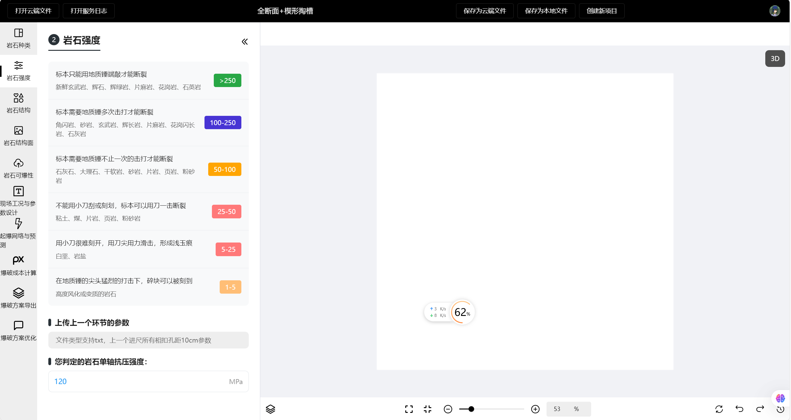

## Page1:RockSpecies


## Pege2:RockStrength



## Page10:FeedBack


## How to start

Clone the project:

```
git clone https://github.com/Tryoe/frontAibalst.git
```

Install dependencies, currently using pnpm, but other package managers should work too.

```
pnpm i
```

Start the project on development mode

```
pnpm dev
```

App should be running now.

## Contribution

Feel free to contribute by opening issues with any questions, bug reports or feature requests.
